# Garden Guardian<h1 align="center">Student Diary</h1>

<p align="center">
   <a href="https://opensource.org/licenses/Apache-2.0"></a>
   <a href="https://android-arsenal.com/api?level=27"></a>
  <br>
  <a href="https://wa.me/+5532998002817"></a>
  <a href="https://www.linkedin.com/in/leonardotissi/"></a>
  <a href="mailto:leonardo.tissi.si@gmail.com"></a>
</p>

<p align="center">  

⭐ Esse é um projeto para demonstrar meu conhecimento técnico no desenvolvimento Android nativo com Kotlin. Mais informações técnicas abaixo.

O aplicativo que desenvolvi possui a capacidade de monitorar a umidade do solo por meio de comunicação Bluetooth com Arduino. Esse projeto foi concebido com o intuito de aprimorar minha compreensão e habilidades em Jetpack Compose, uma abordagem inovadora para construir layouts de forma eficiente no ambiente Android. Além do Compose, integrei o Room Database para armazenar imagens da planta, o Coil para o carregamento rápido de imagens, o Browser para acessar páginas da web personalizadas, o Navigation para facilitar a navegação, o Firebase Crashlytics para rastrear eventuais erros no aplicativo, o Google Fonts para personalizar a tipografia do projeto e o Lottie Animation para inserir animações interativas. Ademais, utilizei o Koin para a injeção de dependências.

A aplicação também incorpora o Broadcast Receiver para monitorar o estado do Bluetooth (ativado ou desativado) e para supervisionar a conexão com o Arduino. Além disso, implementei o Service para realizar a leitura de dados do Arduino em segundo plano e para exibir esses dados por meio de notificações.

</p>

</br>

<p float="left" align="center">
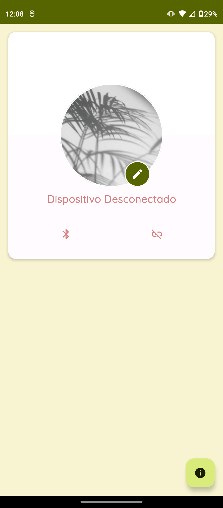
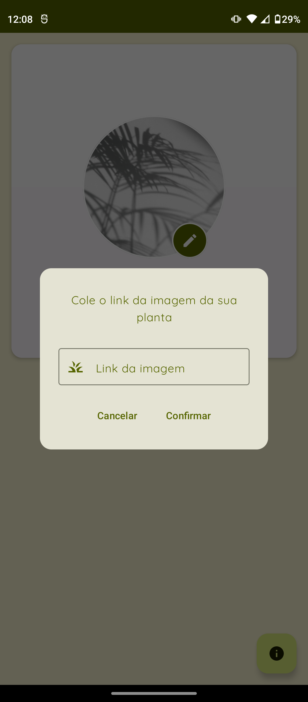
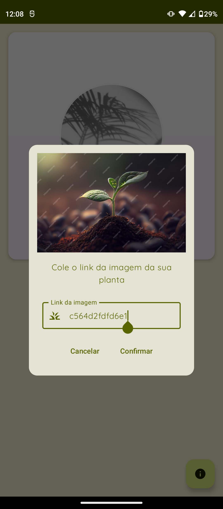
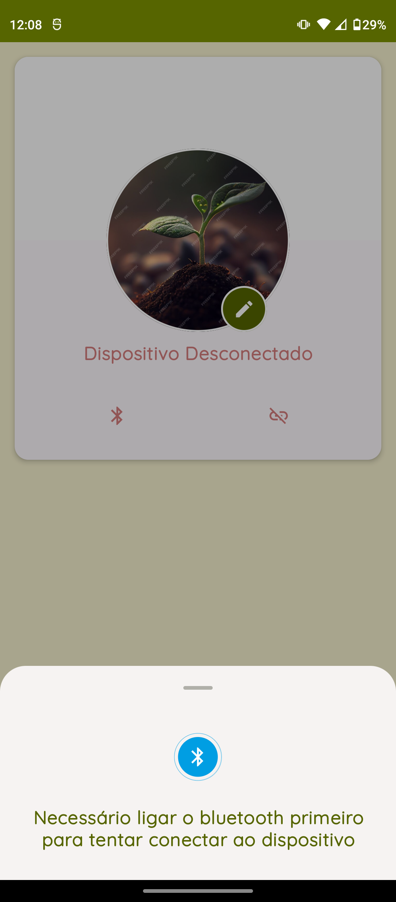
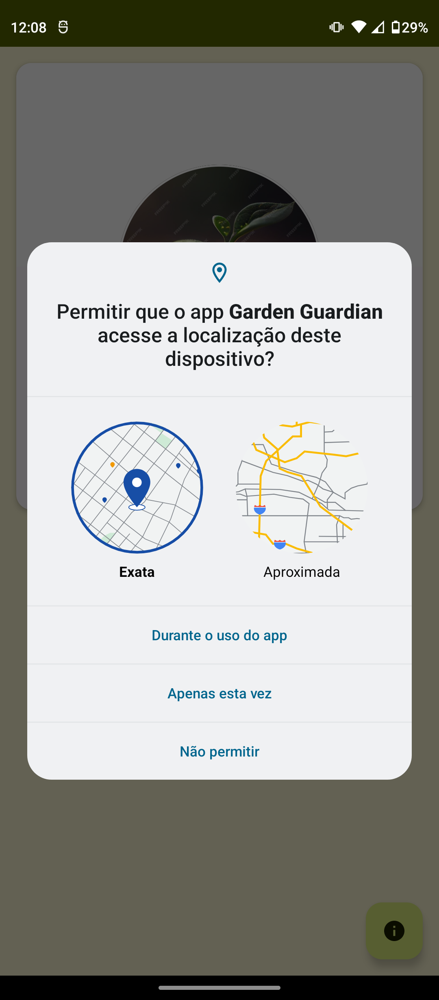
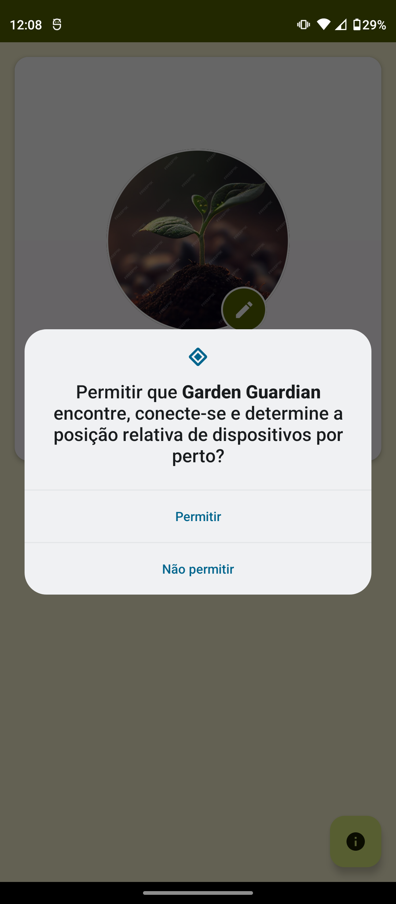

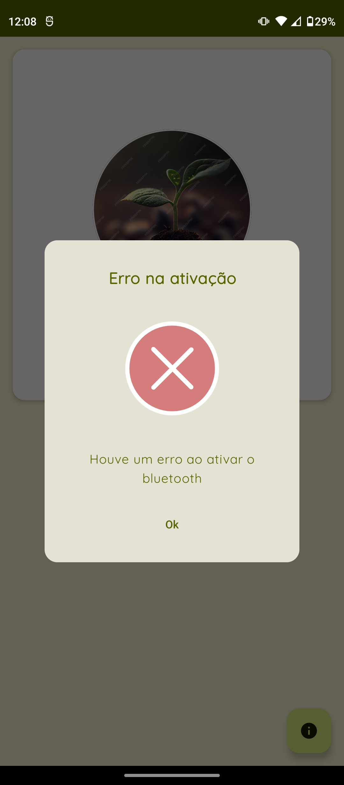
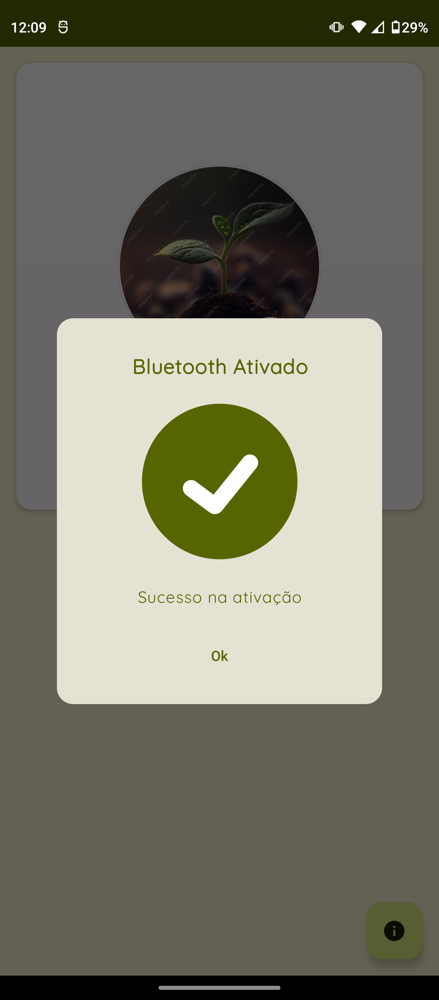
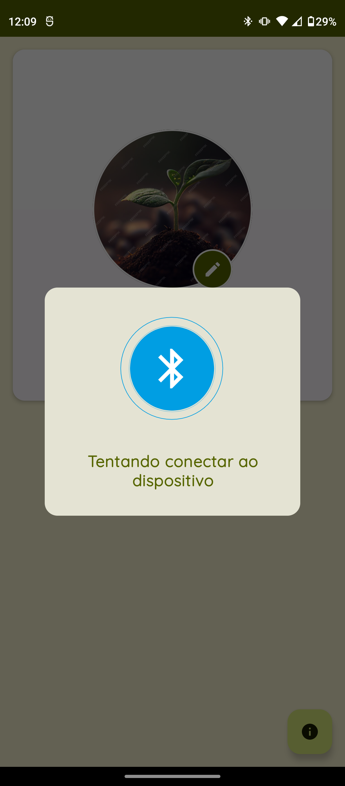
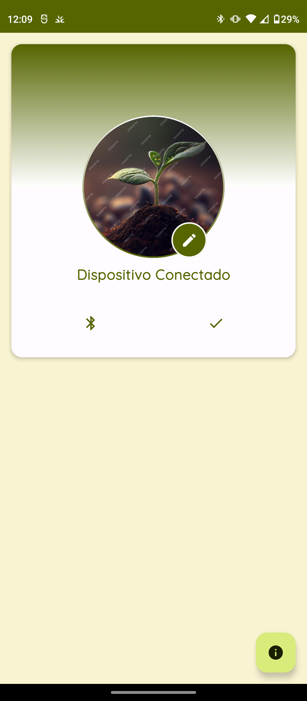
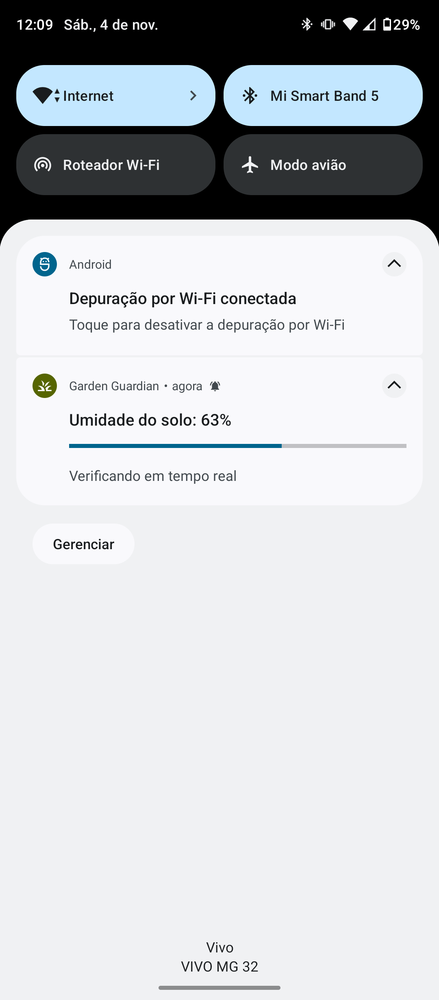
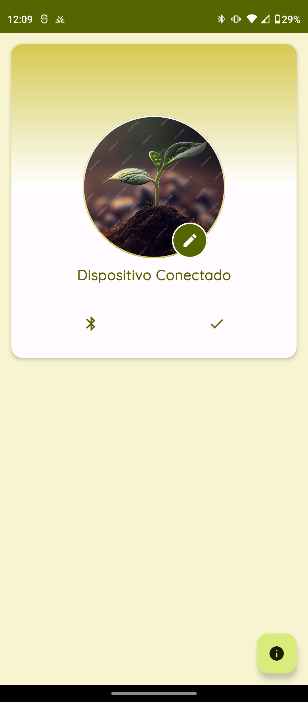
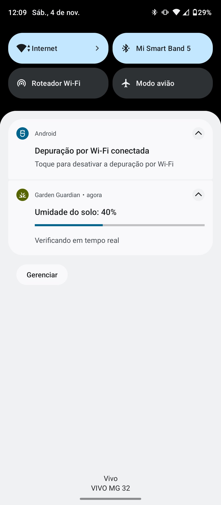
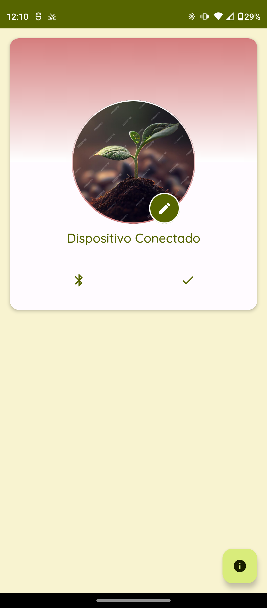
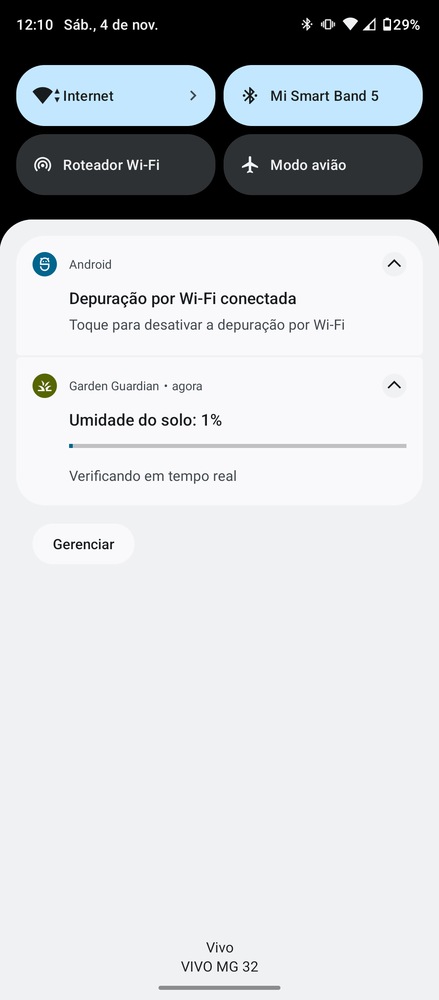
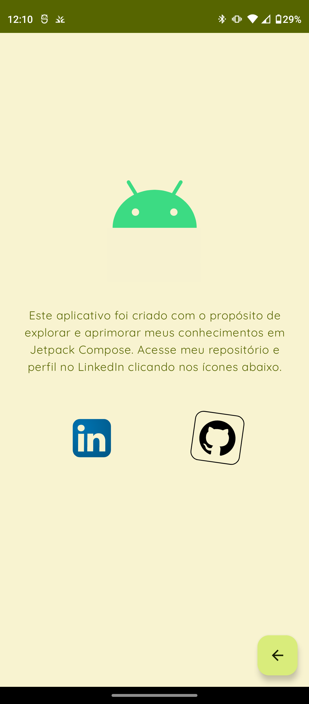
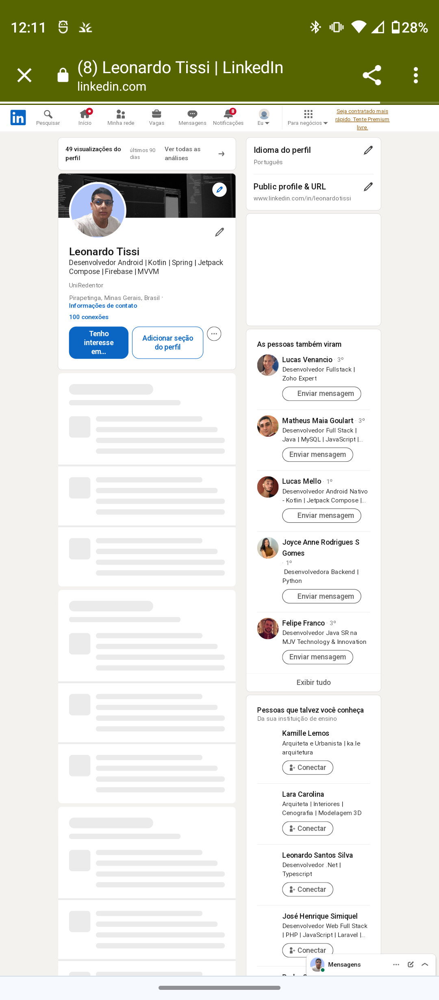
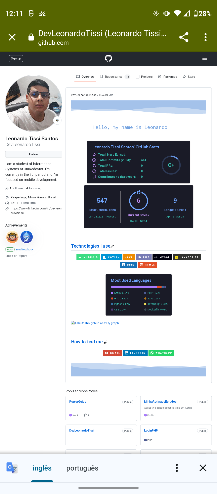
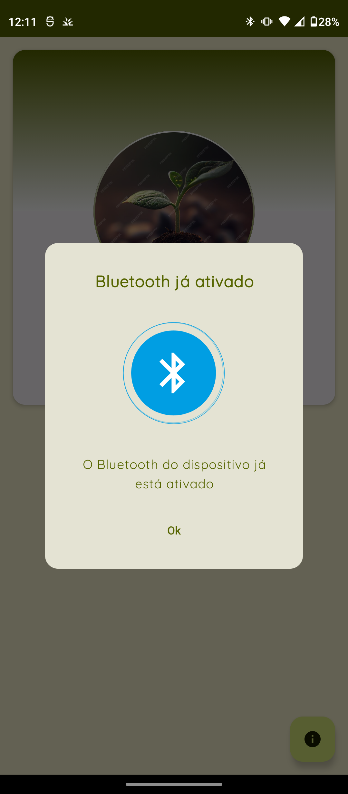
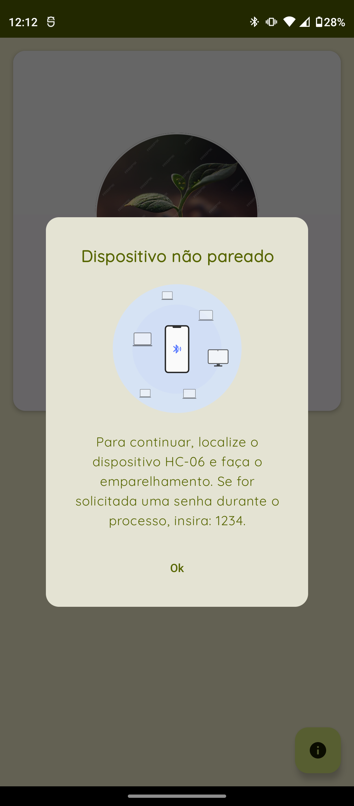


</p>

Faça o download da <a href="/app/release/app-release.apk?raw=true">APK diretamente</a>. Você pode ver <a href="https://www.google.com/search?q=como+instalar+um+apk+no+android">aqui</a> como instalar uma APK no seu aparelho android.

## Tecnologias usadas e bibliotecas de código aberto

- Minimum SDK level 27
- [Linguagem Kotlin](https://kotlinlang.org/)

- Jetpack
  - Lifecycle: Observe os ciclos de vida do Android e manipule os estados da interface do usuário após as alterações do ciclo de vida.
  - ViewModel: Gerencia o detentor de dados relacionados à interface do usuário e o ciclo de vida. Permite que os dados sobrevivam a alterações de configuração, como rotações de tela.
  - ViewBinding: Liga os componentes do XML no Kotlin através de uma classe que garante segurança de tipo e outras vantagens.
  - Custom Views: View customizadas feitas do zero usando XML.
  - LifecycleScope: Para execuções em coroutine.
  - DataStore: Armazenamento de dados em cache.
  - View Binding - Gerenciar views.
  - Fragment 
  - Navigation - Criação e estruturação da IU do app, gerenciando links diretos e navegação entre telas.
  - Room - Criação e gerenciamento de dados persistentes em um banco de dados SQLite
  - Work Manager - Gerenciar tarefas em segundo plano baseadas em restrições
  - Biometric - Autenticação com biometria ou credenciais do dispositivo
  - Browser - Exibir páginas da web no navegador padrão do usuário
  - Coroutines
  

 
- Arquitetura
  - MVVM (View - ViewModel - Model)
  - Comunicação da ViewModel com a View através de LiveData
  - Repositórios para comunicação entre o viewModel e o Retrofit
  

- Bibliotecas
  - [Firebase:](https://firebase.google.com/) Conjunto de serviços da Google fortemente indicados para o desenvolvimento Android.
  - [Retrofit2:](https://github.com/square/retrofit) Para realizar requisições seguindo o padrão HTTP.
  - [Koin:](https://insert-koin.io/) Para Injeção de dependência
  - [Coil:](https://github.com/coil-kt/coil) Para load de imagens a partir da URL.
  - [Lottie Animation:](https://lottiefiles.com/) Animações para XML.
  - [Google auth:](https://firebase.google.com/docs/auth/android/google-signin?hl=pt-br) Autenticação através da conta Google.
  - [Facebook auth:](https://developers.facebook.com/docs/facebook-login/overview) Autenticação através da conta Google

 
 

## Arquitetura

**Student Diary** utiliza a arquitetura MVVM e o padrão de Repositories, que segue as [recomendações oficiais do Google](https://developer.android.com/topic/architecture).
</br></br>

<div align="center" style=" width: 100%; background-color: white; ">

</div>
<br>

## API Utilizada

- [Dicionário API:](https://github.com/DevLeonardoTissi/DicionarioAPI)  Api feita por mim capaz de realizar consultas ao site Dicio.com.br


## Features
### Firebase Services
### Room database
### Work manager
### Services
### Broadcast Receiver
### Data Store
### Material Design Components
### View Binding
### Navigation

<br>

<div align="center" style=" width: 100%; display: inline-block;  justify-content: space-between;">
  


</div>


# Licença

```xml
Copyright [2023] [Leonardo Tissi]

Licensed under the Apache License, Version 2.0 (the "License");
you may not use this file except in compliance with the License.
You may obtain a copy of the License at

  http://www.apache.org/licenses/LICENSE-2.0

Unless required by applicable law or agreed to in writing, software
distributed under the License is distributed on an "AS IS" BASIS,
WITHOUT WARRANTIES OR CONDITIONS OF ANY KIND, either express or implied.
See the License for the specific language governing permissions and
limitations under the License.
```
